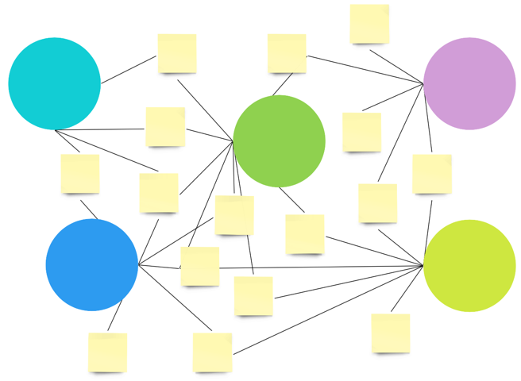

# curator

A computer-use agent that reads new arXiv papers on topics you care about, reviews them like a top-conference reviewer, and turns the result into:

- a **Trello list** of papers to read, each card cover showing the paper's main architecture figure, and
- a **Miro board** that grows over time — papers as colored circles, idea sticky notes between them connected by thick lines.

You trigger a run by adding a list to a Trello board. The list name is the topic.

---

## What it produces

**Trello** (papers only — your "read later" pile):

- One card per paper that passed the rating threshold.
- Cover image is the cropped architecture figure (not a full-page render).
- Description has the NeurIPS-style review: rating, soundness, contribution, strengths, weaknesses, rationale, abstract.

**Miro** (the ideation graph):

- One colored circle per paper, scattered around the canvas via spring layout.
- One yellow sticky per cross-paper idea, placed between its source-paper circles.
- Each idea's sticky shows a `(novelty N/10)` rating — how surprising the synergy is.
- Thick connectors fan out from each source paper to the ideas it contributed to.
- Re-running the same topic adds new ideas; existing items are reused, not duplicated.



---

## Setup (one-time)

```bash
git clone <this repo>
cd curator
python3.11 -m venv .venv
source .venv/bin/activate
pip install -r requirements.txt
playwright install chromium
```

Create a `.env` file in the repo root:

```
ANTHROPIC_API_KEY=sk-ant-...
TRELLO_KEY=...
TRELLO_TOKEN=...
TRELLO_BOARD_NAME=Papers Arena
MIRO_TOKEN=...
```

Where to find each:

- **`ANTHROPIC_API_KEY`** — [console.anthropic.com](https://console.anthropic.com) → API Keys.
- **`TRELLO_KEY` / `TRELLO_TOKEN`** — go to [trello.com/app-key](https://trello.com/app-key); the page shows your `key` and has a "manually generate a token" link for the `token`. The default token covers what's needed (read + write on your boards).
- **`TRELLO_BOARD_NAME`** — name of the topic-trigger board. Defaults to `Papers Arena`.
- **`MIRO_TOKEN`** — at [miro.com](https://miro.com) → your profile → Apps → "Create new app", install it, copy the access token. The token must include the `boards:write` scope (the default scope set on a freshly-installed app does).

### You don't create any boards by hand

The `.env` keys above are the *only* thing you set up. Everything board-shaped is provisioned for you the first time it's needed:

- **Trello board** — `main.py` looks up `TRELLO_BOARD_NAME` on your account at startup. If it doesn't exist, it creates it (empty, no default lists) and prints the URL.
- **Per-topic Miro boards** — each Trello list you add is a topic, and each topic gets its own dedicated Miro board, created by the agent via `POST /v2/boards` the first time the topic runs. The board name = topic name. Re-running the same topic reuses the existing board (idempotent — see `.state/miro_state.json`).
- **Miro login session** — on the first run, a Chromium window opens at miro.com for a one-time interactive login. Log in normally, return to the terminal, press Enter. The session is saved to `.miro_session.json` and reused. If it expires (cookies last a few weeks), refresh with `python setup_miro_login.py`.

If a token is missing the right scope you'll see a 401 from the API on the first attempted call — Trello at startup, Miro on the first topic run.

---

## Running

```bash
source .venv/bin/activate
python main.py
```

You'll see:

```
Baselined N existing lists on 'Papers Arena'.
Watching 'Papers Arena' every 30s. Ctrl+C to stop.
```

To trigger a pipeline run, open your Trello board and add a new list. Type a topic (e.g. `mechanistic interpretability`) and hit Enter. Within 30 seconds the script picks it up:

```
New list detected: 'mechanistic interpretability' — running pipeline…
  fetched 8 candidates from arXiv
  [1/8] reviewing: <paper title>…
    ACCEPT — rating 8/10, soundness 4/4, contribution 3/4 ($0.6, 95s)
  …
  → 2 idea(s) proposed
  -> posted 4 paper card(s)
  [Miro CU] phase 1: pre-flight cleanup analysis…
  [Miro CU] phase 2: REST placing 4 paper circle(s) via spring layout…
  [Miro CU] phase 3: CU placing 2 idea sticky(s) at convergence points…
  [Miro CU] phase 4: drew 8 connector(s)
```

A Chromium window opens. Each task runs in a new tab inside the same window. The window stays open for the duration of the topic.

Stop with Ctrl+C. The script just polls; killing it is safe.

**Cost per topic** (default settings, `claude-sonnet-4-6`): ~$2–$5. Switching to `claude-opus-4-7` is ~5× that.

---

## Configuration knobs

Set in `.env` or inline (`VAR=value python main.py`).

| Variable | Default | What |
|---|---|---|
| `CLAUDE_MODEL` | `claude-sonnet-4-6` | Default model. `REVIEWER_MODEL` and `SYNTHESIZE_MODEL` fall back to this when unset. |
| `REVIEWER_MODEL` | `$CLAUDE_MODEL` | Model used by the per-paper reviewer (CU / pipeline / text modes). |
| `SYNTHESIZE_MODEL` | `$CLAUDE_MODEL` | Model used for the cross-paper ideation call. |
| `MIRO_CU_MODEL` | `$CLAUDE_MODEL` | Model used by the Miro CU agent. Miro's web UI is the hardest visual task in the pipeline, so consider overriding to `claude-opus-4-7` for higher reliability. |
| `REVIEWER_MODE` | `pipeline` | `pipeline` (default — one Claude call with N viewport screenshots; submit_review returns the figure bbox) / `computer_use` (full CU agent reads the PDF visually) / `text` (PyMuPDF text extraction, no vision; hero figure is captured separately by the `find_figures` step) |
| `FIND_FIGURES_ENABLED` | `1` | When `1`, the `find_figures` step runs a bounded CU sub-loop on each kept paper to capture its architecture diagram. Set to `0` to skip and post papers without thumbnails. |
| `FIGURE_FINDER_MAX_STEPS` | `6` | CU sub-loop turn budget for the figure finder. |
| `SEARCH_MAX` | `8` | arXiv candidates fetched per topic. |
| `KEEP_TOP` | `4` | Max papers kept after review threshold. |
| `MIN_RATING` / `MIN_SOUNDNESS` / `MIN_CONTRIBUTION` | `7 / 3 / 3` | Thresholds a paper must clear to be kept. |
| `MIRO_BACKEND` | `cu` | `cu` = CU agent places idea stickies; `rest` = deterministic, no agent. |
| `MIRO_FALLBACK_TO_REST` | `1` | If the CU agent crashes, silently fall back to REST. |
| `MIRO_ENABLED` | `1` | Set `0` to skip Miro entirely (Trello-only). |
| `SYNTHESIZE_ENABLED` | `1` | Set `0` to skip cross-paper idea generation. |
| `HEADLESS` | `0` | `1` = invisible browser. `0` = visible (good for demos). |

---

## Standalone debug commands

```bash
# Review a single paper end-to-end (no Trello/Miro). Prints the JSON review
# and saves the cropped figure to /tmp/review_figure.png.
python reviewer.py 1706.03762

# Refresh the Miro session if cookies expired.
python setup_miro_login.py
```

---

## Files

```
main.py             orchestrator (LangGraph nodes + Trello-poll loop)
reviewer.py         paper review in 3 modes; reports figure bbox
synthesize.py       cross-paper idea generation with novelty rating
trello.py           paper card creation with figure cover (REST)
miro/               Miro board package
  __init__.py         dispatcher: post_topic_to_miro
  config.py           env vars, layout/CU constants, file paths
  state.py            .state/miro_state.json load/save + idea hashing
  overlays.py         dismiss Sidekick / onboarding modals before CU
  rest.py             REST API + spring layout + post_topic_via_rest
  cu.py               CU sub-loops + the headline CU flow
cu_agent.py         shared computer-use action substrate
helpers.py          Claude client, pricing, PDF helpers, shared browser/page
run_log.py          per-topic stdout/stderr tee → papers/runs/<ts>_<slug>.log
setup_miro_login.py one-time Miro login → saved Playwright session
```

Pipeline state lives in `.state/` (gitignored — never committed):

- **`.state/seen_lists.json`** — Trello list IDs already processed, so re-runs don't re-trigger.
- **`.state/miro_state.json`** — per-topic Miro board IDs and per-board paper/idea item IDs. Re-runs reuse what's already there. Delete the file (or the whole `.state/` folder) to start fresh.

The Playwright Miro login lives at `.miro_session.json` in the repo root (also gitignored) — kept separate because it's a credential, not pipeline state.

---

## How it works

The pipeline (LangGraph):

```
search_arxiv → review_visual → find_figures → synthesize
             → post_to_trello → post_to_miro
```

1. **`search_arxiv`** — arXiv API, last 365 days, sorted by relevance, top `SEARCH_MAX` candidates.
2. **`review_visual`** — per paper, in the default `pipeline` mode: one Claude call with N viewport screenshots of the rendered PDF returns the structured NeurIPS-style review and a normalized bbox for the architecture figure. Threshold filter; top `KEEP_TOP` survive. (Other modes: `computer_use` runs the full CU agent loop; `text` does PyMuPDF text extraction with no vision.)
3. **`find_figures`** — for each kept paper that doesn't already have a figure (i.e., when `text` mode was used), a small bounded CU sub-loop scrolls the rendered PDF, identifies the main architecture figure, and reports its page index + normalized bbox. We render that page at high DPI and crop to the bbox to produce the thumbnail. Skipped via `FIND_FIGURES_ENABLED=0`.
4. **`synthesize`** — one Claude call. Reads all kept reviews; proposes 1–3 cross-paper ideas, each citing ≥2 source papers, with a calibrated `novelty_rating` (1–10).
5. **`post_to_trello`** — paper cards with the review-form description and the cropped figure as cover image.
6. **`post_to_miro`**:
   - REST creates one colored circle per paper at NetworkX spring-layout coordinates (connected papers cluster, edge crossings minimized).
   - A CU pre-flight pass scans the board and deletes any stale leftovers from prior runs.
   - CU places one yellow sticky per idea, between its source paper circles, including the novelty rating in the content.
   - REST draws thick connectors from each source paper to the ideas it contributed to.

### Where computer-use earns its place

The system uses Anthropic's `computer_20251124` tool deliberately, only where vision + UI is doing real work:

| Where CU runs | What it's actually doing |
|---|---|
| Hero figure capture (`find_figures` step, default) | Visually identifying which figure is the architecture diagram and reporting its page+bbox so we can crop it tightly. PyMuPDF text extraction can't tell which figure to crop; you need eyes on the page. |
| Paper review (full `computer_use` mode, opt-in) | Reading figures, ablation tables, architecture diagrams as visual content for the verdict itself — useful where visual reading materially changes the score. |
| Miro idea placement | Placing each sticky at the visual midpoint of its source paper circles. Looking at the canvas and clicking where a person would. |

CU is **not** used for things APIs do better — arXiv search, the verdict text in default mode (text extraction is enough for the rubric), synthesis (pure language), Trello, Miro paper circles + connectors. That separation is the system's design point.

### Idempotency

- Paper circles, idea stickies, and connectors are all deduped per board.
- State (`.state/miro_state.json`) tracks Miro item IDs and is validated against the live board on each run, so deletions you make manually don't corrupt state.
- Connectors are checked against existing pairs before being drawn; re-runs don't stack lines.

### Failure modes

- One paper's review crashing doesn't kill the topic — wrapped in `try/except`, the bad paper is dropped and the loop continues.
- The Miro CU phase falls back to REST silently if anything goes sideways (set `MIRO_FALLBACK_TO_REST=0` to opt out).
- Figure extraction returning `None` just means the Trello card has no cover image; everything else still posts.

---

## Why this exists

In an interview I was asked to design a computer-use agent that schedules meetings. I didn't have a strong mental model of CU at the time and my answer was hand-wavy. Working on this afterward, the thing that clicked for me — and that this project deliberately demonstrates — is:

> **Computer use earns its place where APIs don't exist, where the content is inherently visual, or where the agent's "hands" need to operate on a real UI. It doesn't earn its place as a substitute for APIs that already do the job better.**

The pipeline has CU agents in two places (paper review, Miro idea placement) and pointedly does *not* use CU in four others (arXiv, synthesis, Trello, Miro paper layout). That's the demonstration.
