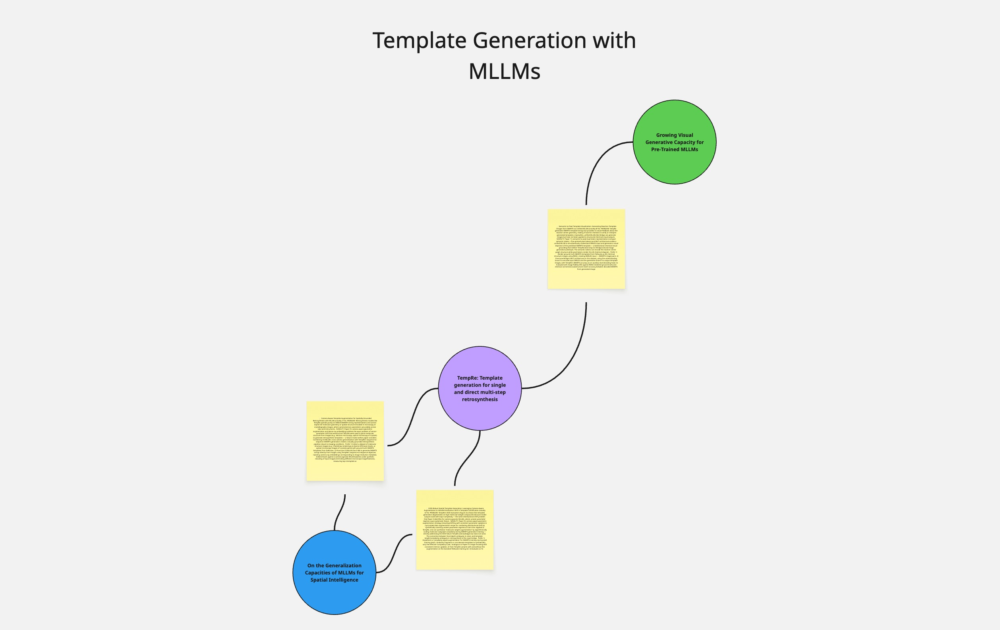

# ResearX

A computer-use agent that reads latest arXiv papers on topics you care about, reviews them like a top-conference reviewer, and turns the result into:

- a **Trello list** of papers to read with the main architecture and a summary, and
- a **Miro board** for storyboarding ideas that grows over time — papers as colored circles, idea sticky notes between them connected by thick lines.

You trigger a run by adding a list to a Trello board. The list name is the topic.

> **Why this design.** Computer use earns its place where APIs don't exist, where the content is inherently visual, or where the agent's "hands" need to operate on a real UI — *not* as a substitute for APIs that already do the job. ResearX uses CU in exactly two places — hero-figure capture from a PDF and Miro idea-sticky placement on the canvas — and pointedly does *not* use it for arXiv search, synthesis, Trello, or Miro paper-circle layout. That separation is the demonstration.

---

## What it produces

**Trello** (papers only — your "read later" pile):

- One card per paper that passed the rating threshold.
- Cover image is the cropped architecture figure (not a full-page render).
- Description has the NeurIPS-style review: rating, soundness, contribution, strengths, weaknesses, rationale, abstract.

**Miro** (the ideation graph):

- One colored circle per paper, scattered around the canvas via spring layout.
- One yellow sticky per cross-paper idea, placed between its source-paper circles.
- Each idea's sticky shows a `(novelty N/10)` rating — how surprising the synergy is.
- Thick connectors fan out from each source paper to the ideas it contributed to.
- Re-running the same topic adds new ideas; existing items are reused, not duplicated.



---

## Setup (one-time)

```bash
git clone <this repo>
cd curator
python3.11 -m venv .venv
source .venv/bin/activate
pip install -r requirements.txt
playwright install chromium
```

Create a `.env` file in the repo root:

```
ANTHROPIC_API_KEY=sk-ant-...
TRELLO_KEY=...
TRELLO_TOKEN=...
TRELLO_BOARD_NAME=Papers Arena
MIRO_TOKEN=...
```

Where to find each:

- **`ANTHROPIC_API_KEY`** — [console.anthropic.com](https://console.anthropic.com) → API Keys.
- **`TRELLO_KEY` / `TRELLO_TOKEN`** — go to [trello.com/app-key](https://trello.com/app-key); the page shows your `key` and has a "manually generate a token" link for the `token`. The default token covers what's needed (read + write on your boards).
- **`TRELLO_BOARD_NAME`** — name of the topic-trigger board. Defaults to `Papers Arena`.
- **`MIRO_TOKEN`** — at [miro.com](https://miro.com) → your profile → Apps → "Create new app", install it, copy the access token. The token must include the `boards:write` scope (the default scope set on a freshly-installed app does).

### You don't create any boards by hand

The `.env` keys above are the *only* thing you set up. The Trello board, per-topic Miro boards, and the Miro login session are all provisioned automatically on first run.

---

## Running

```bash
source .venv/bin/activate
python main.py
```

You'll see:

```
Baselined N existing lists on 'Papers Arena'.
Watching 'Papers Arena' every 30s. Ctrl+C to stop.
```

To trigger a pipeline run, open your Trello board and add a new list. Type a topic (e.g. `mechanistic interpretability`) and hit Enter. Within 30 seconds the script picks it up:

```
New list detected: 'mechanistic interpretability' — running pipeline…
  fetched 8 candidates from arXiv
  [1/8] reviewing: <paper title>…
    ACCEPT — rating 8/10, soundness 4/4, contribution 3/4 ($0.6, 95s)
  …
  → 2 idea(s) proposed
  -> posted 4 paper card(s)
  [Miro CU] phase 1: pre-flight cleanup analysis…
  [Miro CU] phase 2: REST placing 4 paper circle(s) via spring layout…
  [Miro CU] phase 3: CU placing 2 idea sticky(s) at convergence points…
  [Miro CU] phase 4: drew 8 connector(s)
```

A Chromium window opens. Each task runs in a new tab inside the same window. The window stays open for the duration of the topic.

Stop with Ctrl+C. The script just polls; killing it is safe.

**Cost per topic** (default settings, `claude-sonnet-4-6`): ~$1–$2.

---

## Configuration knobs

Set in `.env` or inline (`VAR=value python main.py`).

| Variable | Default | What |
|---|---|---|
| `CLAUDE_MODEL` | `claude-sonnet-4-6` | Default model. `REVIEWER_MODEL` and `SYNTHESIZE_MODEL` fall back to this when unset. |
| `REVIEWER_MODEL` | `$CLAUDE_MODEL` | Model used by the per-paper reviewer (CU / pipeline / text modes). |
| `SYNTHESIZE_MODEL` | `$CLAUDE_MODEL` | Model used for the cross-paper ideation call. |
| `MIRO_CU_MODEL` | `$CLAUDE_MODEL` | Model used by the Miro CU agent. Miro's web UI is the hardest visual task in the pipeline, so consider overriding to `claude-opus-4-7` for higher reliability. |
| `REVIEWER_MODE` | `pipeline` | `pipeline` (default — one Claude call with N viewport screenshots; submit_review returns the figure bbox) / `computer_use` (full CU agent reads the PDF visually) / `text` (PyMuPDF text extraction, no vision; hero figure is captured separately by the `find_figures` step) |
| `FIND_FIGURES_ENABLED` | `1` | When `1`, the `find_figures` step runs a bounded CU sub-loop on each kept paper to capture its architecture diagram. Set to `0` to skip and post papers without thumbnails. |
| `FIGURE_FINDER_MAX_STEPS` | `6` | CU sub-loop turn budget for the figure finder. |
| `SEARCH_MAX` | `8` | arXiv candidates fetched per topic. |
| `KEEP_TOP` | `4` | Max papers kept after review threshold. |
| `MIN_RATING` / `MIN_SOUNDNESS` / `MIN_CONTRIBUTION` | `7 / 3 / 3` | Thresholds a paper must clear to be kept. |
| `MIRO_BACKEND` | `cu` | `cu` = CU agent places idea stickies; `rest` = deterministic, no agent. |
| `MIRO_FALLBACK_TO_REST` | `1` | If the CU agent crashes, silently fall back to REST. |
| `MIRO_ENABLED` | `1` | Set `0` to skip Miro entirely (Trello-only). |
| `SYNTHESIZE_ENABLED` | `1` | Set `0` to skip cross-paper idea generation. |
| `HEADLESS` | `0` | `1` = invisible browser. `0` = visible (good for demos). |

---

## Standalone debug commands

```bash
# Review a single paper end-to-end (no Trello/Miro). Prints the JSON review
# and saves the cropped figure to /tmp/review_figure.png.
python reviewer.py 1706.03762

# Refresh the Miro session if cookies expired.
python setup_miro_login.py
```

---

## How it works

The pipeline (LangGraph):

```
search_arxiv → review_visual → find_hero_figure → synthesize_ideas
             → post_to_trello → create_miro_board
```

1. **`search_arxiv`** — arXiv API, last 365 days, sorted by relevance, top `SEARCH_MAX` candidates. It can later be converted to a daily cron job to add more papers to the reading list.
2. **`review_visual`** — per paper, in the default `pipeline` mode: one Claude call with N viewport screenshots of the rendered PDF returns the structured NeurIPS-style review. (Other modes: `computer_use` runs the full CU agent loop; `text` does PyMuPDF text extraction with no vision.)
3. **`find_figures`** — for each kept paper that doesn't already have a figure (i.e., when `text` mode was used), a small bounded CU sub-loop scrolls the rendered PDF, identifies the main architecture figure, and reports its page index + normalized bbox. We render that page at high DPI and crop to the bbox to produce the thumbnail. Skipped via `FIND_FIGURES_ENABLED=0`.
4. **`synthesize`** — one Claude call. Reads all kept reviews; proposes 1–3 cross-paper ideas, each citing ≥2 source papers, with a calibrated `novelty_rating` (1–10).
5. **`post_to_trello`** — paper cards with the review-form description and the cropped figure as cover image.
6. **`post_to_miro`**:
   - REST creates one colored circle per paper at NetworkX spring-layout coordinates (connected papers cluster, edge crossings minimized).
   - A CU pre-flight pass scans the board and deletes any stale leftovers from prior runs.
   - CU places one yellow sticky per idea, between its source paper circles, including the novelty rating in the content.
   - REST draws thick connectors from each source paper to the ideas it contributed to.

### Where computer-use earns its place

The system uses Anthropic's `computer_20251124` tool deliberately, only where vision + UI is doing real work:

| Where CU runs | What it's actually doing |
|---|---|
| Hero figure capture (`find_figures` step, default) | Visually identifying which figure is the architecture diagram and reporting its page+bbox so we can crop it tightly. PyMuPDF text extraction can't tell which figure to crop; you need eyes on the page. |
| Paper review (full `computer_use` mode, opt-in) | Reading figures, ablation tables, architecture diagrams as visual content for the verdict itself — useful where visual reading materially changes the score. |
| Miro idea placement | Placing each sticky at the visual midpoint of its source paper circles. Looking at the canvas and clicking where a person would. |

CU is **not** used for things APIs do better — arXiv search, the verdict text in default mode (text extraction is enough for the rubric), cross pollinating ideas from paper (pure language), Trello, Miro paper circles + connectors. That separation is the system's design point.

### Idempotency

- Paper circles, idea stickies, and connectors are all deduped per board.
- State (`.state/miro_state.json`) tracks Miro item IDs and is validated against the live board on each run, so deletions you make manually don't corrupt state.


## Limitations & next steps

**Known limitations**

- **Miro CU sticky placement fails ~10% of the time** on dense boards — Sidekick popup, coordinate drift after auto-pan, missed double-click. The pipeline silently falls back to REST placement at the layout-computed convergence point, so the board still completes, but the visual narrative ("agent picks the spot") loses fidelity for that idea. While there are existing functions to retrieve the agent from these failure modes, using OPUS shows are tremendous improvement in the ideaboarding task.
- **`find_figures` occasionally picks the wrong figure** when Figure 1 is a teaser plot and the real architecture is Figure 2. The fallback is a page-1 render, which usually still shows what the reader needs.
- **Pipeline-mode review latency is bursty.** A single Claude call with 8 viewport screenshots takes 30-120 s on Sonnet, longer on Opus + Bedrock cross-region. The current log doesn't break out per-stage time, so a slow stage feels like a hang.
- **No automated tests.** Verification is "did the run end with a board?". The pure functions (`compute_layout`, `cost_from_usage`, `arxiv_pdf_url`) are obvious targets for a smoke pytest suite.

**Next steps (in priority order)**

This system can be improved a lot! I'm listing down a few immediate possibilities.

- **Pre-filter Research Papers**: An additional stage where extremely unworthy papers can be filtered using simpler techniques.
- **Cross domain Ideaboards**: The present setup only ideates within a topic while a lot of innovation can be added by combining different topics.
- **Improved reliable scaling**: cost effective scaling for constructing large boards with more than 10 papers.
- **Human in the loop**: Shared trello boards and researchers being in the loop for ideation would be very cool.